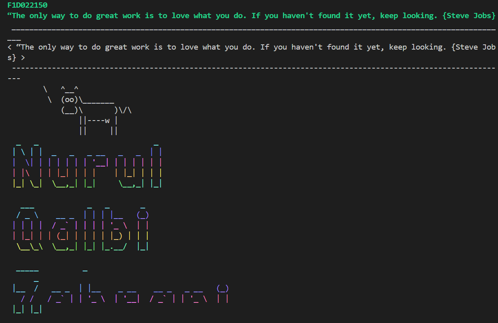
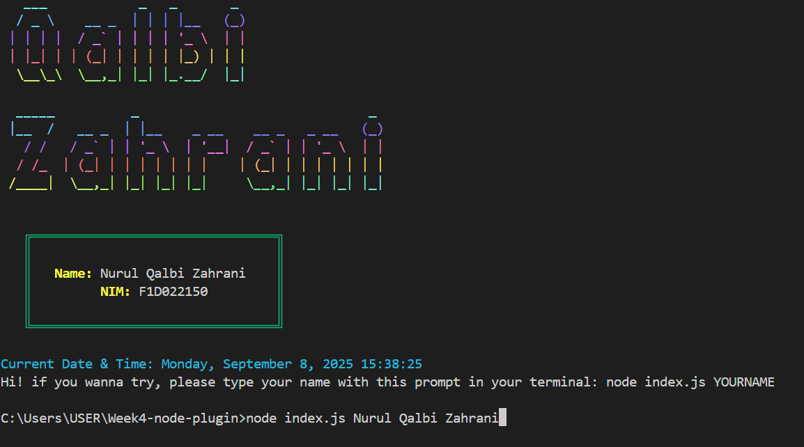
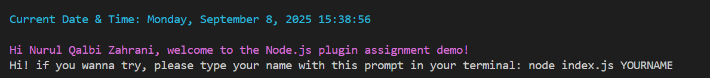

# Week4-node-plugin
# 4th Week Task 
# Pemrograman Lanjut Web 2025 

## Nurul Qalbi Zahrani - F1D022150
---
Welcomeeeeeee!!!

This project is a Node.js script that displays student name and ID, motivational quotes by Steve Jobs, ASCII art, display current date & time, with a fun squirrel output.  
It also accepts input arguments from the terminal to greet a user dynamically!!
I use NPM for this and ESModule for this task!S

---

## How to Install Dependencies?!

This project uses the following Node.js packages:

- [chalk](https://www.npmjs.com/package/chalk) — for colored text in the terminal
- [cowsay](https://www.npmjs.com/package/cowsay) — for ASCII cow or squirrel speech bubbles
- [figlet](https://www.npmjs.com/package/figlet) — for ASCII banners
- [gradient-string](https://www.npmjs.com/package/gradient-string) — for colorful gradient text
- [boxen](https://www.npmjs.com/package/boxen) — for boxed text
- [dayjs](https://www.npmjs.com/package/dayjs) — for date and time formatting

---

## Follow This Installation Steps!!

1. Clone the repository or download the project files.
2. Open a terminal in the project folder.
3. Make sure [Node.js](https://nodejs.org/) is installed!!!!
4. Install dependencies:

npm install chalk cowsay figlet gradient-string boxen dayjs

Add "type": "module" to package.json to enable ES Module syntax:
{
  "type": "module"
}

## ️ How to Run the Project?!

Open terminal in the project folder.

Run the project:

node index.js

## Note:
To pass your name and NIM as input arguments:

node index.js "YourName - YourNIM"

example Output:

# That's it! Thank youuuu!!
